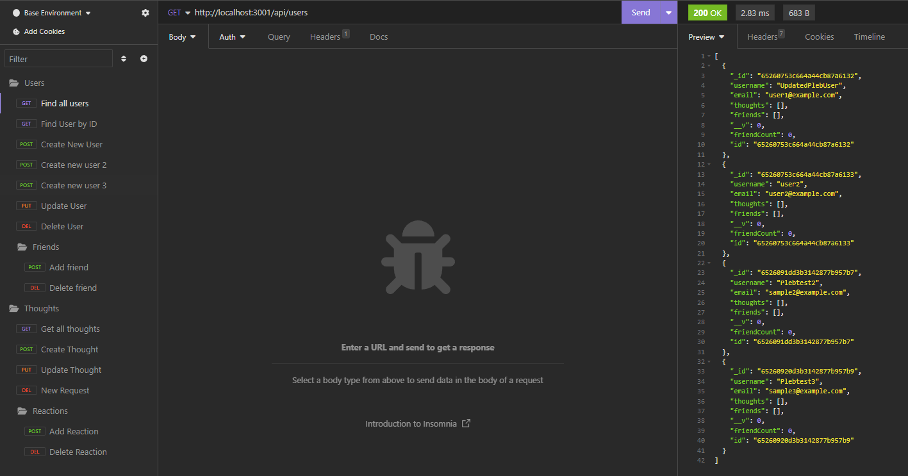

# noSQL-Social

## License

The ISC License simply removes language that would be considered extraneous according to the Berne Convention. The ISC License is considered equivalent to the Simplified (2-Clause) BSD License but with more concise language.

## Description
This application is a noSQL-based social networking API allowing users to share their thoughts, react to friends' thoughts, and build a friend list. Built using Express.js and Mongoose, it offers a robust API for client applications to interact with.

 
*This image represents a mockup of how the API routes might be visualized in a client application.*

For a video walkthrough of the API endpoints: [Link to video walkthrough](https://youtu.be/v8509l1M1Ys)

## Table of Contents
- [Description](#description)
- [Installation](#installation)
- [Usage](#usage)
- [License](#license)
- [Questions](#questions)

## Installation
- This app requires Node.js and the following packages:
  - express
  - dotenv
  - mongoose

To install, clone the repository and run `npm install`.

## Usage
- Start the server by running `node server.js` in your terminal.
- Access the API routes using a tool like Insomnia or Postman.
- Routes include user, thought, and reaction management.

## Questions
- For any questions or concerns, please reach out through the following contact information:

  - Github: [mHammy](https://github.com/mHammy)
  - Email: matthewrhamiltonis@gmail.com
